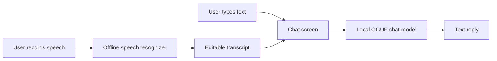

# Project architecture

## User flow

All inference runs on the phone after the model files are installed. Airplane mode must not break chat or transcription. Spoken replies are outside the first scope; speech input means audio-to-text.

## Components

| Component | Owner | Input | Output | First milestone |
| --- | --- | --- | --- | --- |
| Android chat UI | App collaborator | User text | Displayed reply | Yes |
| Local chat runtime | App collaborator | Text plus local GGUF path | Generated text | Yes |
| Chat model and evaluation | Language collaborator | Reviewed Waray examples | Versioned GGUF and report | Yes |
| Offline speech recognizer | Joint work | Recorded audio | Editable transcript | Later |

The app must load a model from local storage, report load failures, let the user clear conversation history, and avoid requiring an Ollama server or Internet connection at runtime. [The model handoff](handoff.md) defines the exchange between app and language work.

## Device target

- Minimum Android: **9 / API 28**.
- CPU architecture: **64-bit ARM (`arm64-v8a`)**.
- First test class: **6 GB RAM**. Measure actual free memory and response time on the target phone.
- Keep the initial conversation context modest to limit memory use; tune it from device measurements.

The published llama.cpp Android Studio sample currently declares API 33 as its minimum. The native llama.cpp Android instructions include an `android-28` build. API 28 support in the final app therefore needs integration work and testing on an API 28 device.

## Model path

1. Baseline: Sailor2-1B-Chat, initially using a Q4_K_M GGUF for phone testing.
2. Evaluation: held-out speaker-written Waray prompts and human ratings.
3. If needed: supervised LoRA adaptation of the original model with reviewed Waray chat pairs on a training computer.
4. Delivery: a new versioned GGUF plus the information listed in [docs/handoff.md](handoff.md).

The text corpus and speech corpus have different jobs. Text alone cannot train speech recognition.
