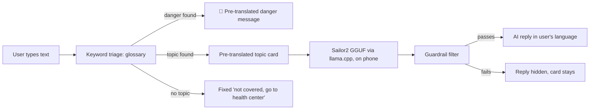

# Architecture: Offline Multilingual Health Helper (Android)

> v2, Oct 9, ~23:00. **Combined plan** confirmed by the project owner: the offline health helper scope
> (`docs/PRD.md`) built on the language collaborator's model track (Sailor2-1B GGUF + llama.cpp + LoRA).
> This file is the source of truth for the **tech stack**. Verified facts: `docs/PROJECT_FACTS.md`.
> Fork reasoning: `docs/DECISIONS.md`. App ↔ model contract: `docs/handoff.md`.

## What it does

A native Android app for people with **no signal**. The user types a health worry in **Bisaya, Waray,
Tagalog/Taglish, or English**. A keyword glossary instantly checks for **danger signs** and picks one of
**7 first-aid topics**. The app shows a **pre-translated topic card**. Then an **on-device Sailor2-1B model
(LoRA-adapted on Waray health chat pairs)** writes a short, natural reply in the user's language, grounded in
that card. Deterministic guardrails filter anything unsafe before it reaches the screen. The internet is used
once, to download the model. After that, everything works in airplane mode.

## User flow



Speech input (later milestone): record → separate offline speech-to-text → **editable transcript** → same chat input.

## Tech stack

| Layer | Choice | Why (if it was a fork) |
|---|---|---|
| Language / UI | Kotlin 2.2.10, Jetpack Compose (BOM 2026.02.01) + Material 3 | Same toolchain as the working Vault project. No LiteRT-LM, so no Kotlin 2.4 bump needed |
| Build | AGP 9.3.1, Gradle 9.5.0, JDK 17 | Verified on this laptop |
| Native inference | **llama.cpp** (pinned release tag, chosen in the Phase 0 spike), built from source with **NDK 27.1.12297006** + CMake, JNI wrapper module | Language collaborator's track. The official `examples/llama.android` sample declares minSdk 33, so it's adapted, not copied (`docs/handoff.md`) |
| Device target | **Android 9 / API 28+**, **`arm64-v8a`** only, first test phone has **6 GB RAM** | Language collaborator's compatibility target |
| Base model | **Sailor2-1B-Chat Q4_K_M GGUF** (`bartowski/Sailor2-1B-Chat-GGUF`, 738,628,576 bytes, Apache-2.0) | Published Waray coverage, small enough for 6 GB phones |
| Adapted model | `waray-health-vN.gguf`: LoRA merged into Sailor2-1B, quantized Q4_K_M | **Shipped only if it beats the baseline** on the held-out set |
| Fallback model (same runtime) | Gemma 4 E2B GGUF | Passed the classification test on Oct 9. Swap only if Sailor2 fails on the phone |
| Model download | Android **DownloadManager**, pinned URL, **SHA-256 verified** | Team decision: app downloads the model once, like `ollama pull` |
| Content | Versioned JSON in `assets/content/`, validated by unit tests | Team edits JSON directly |
| Settings | Jetpack DataStore | Language + model choice |
| Training | PyTorch (cu128) + Transformers + **PEFT/TRL** LoRA on the **RTX 4050 6 GB** laptop. Then merge → llama.cpp `convert_hf_to_gguf.py` → `llama-quantize Q4_K_M` | See `training/README.md`. The 1050 Ti 4 GB is too tight |
| Eval (laptop) | Python + Ollama loading the same GGUF files | Same weights as the phone |
| Database / backend / auth | **None** | No accounts, no history, no server |
| Distribution | GitHub Release: APK + adapted GGUF asset (< 2 GB, fits GitHub's limit) | Repo never holds model files |

Versions are **pinned exactly**. No `latest.release`, no floating llama.cpp `master`.

## Configuration (no secrets)

No API keys or secrets, so there's no env-var contract. Model constants live in `lib/llm/ModelSpec.kt`:

| Model | URL (pinned) | SHA-256 |
|---|---|---|
| Baseline Sailor2-1B Q4_K_M | `https://huggingface.co/bartowski/Sailor2-1B-Chat-GGUF/resolve/9f8154a0ffdf04bb7f29e4f6c3cb938b9178dba3/Sailor2-1B-Chat-Q4_K_M.gguf` | `782e8abed13d51a2083eadfb2f6d94c2cd77940532f612a99e6f6bec9b3501d4` |
| Adapted `waray-health-vN.gguf` | GitHub Release asset URL (set when delivered) | recorded in the `docs/handoff.md` delivery note |

## Data model

No database. **Content** (team-written, all 4 languages) is JSON in `app/src/main/assets/content/`. **Runtime state**
is in memory only and cleared when the app closes.

- Enums (defined once in `domain/model/`):
  - `Language`: `CEB` Bisaya, `WAR` Waray, `TGL` Tagalog/Taglish, `ENG`
  - `TopicId`: `CHILD_DIARRHEA`, `FEVER`, `COUGH_BREATHING`, `WOUND_BLEEDING`, `BURN`, `PREGNANCY_WARNING`, `DENGUE_WARNING`, `NONE`
  - `DangerSignId`: `CANNOT_DRINK`, `VOMITS_EVERYTHING`, `BLOOD_IN_STOOL`, `VERY_SLEEPY`, `DIFFICULTY_BREATHING`, `SEVERE_BLEEDING`, `PREGNANCY_BLEEDING`, `SEIZURE`, `CHEST_PAIN`, `UNCONSCIOUS`

```
TopicId 1---4 TopicCard          (one per Language)
DangerSignId 1---4 DangerMessage (one per Language)
GlossaryEntry *---1 TopicId | DangerSignId
UiString key 1---4 text          (one per Language)
```

| File | Key | Required / constraints |
|---|---|---|
| `topics/<topic_id>.json` | (`topicId`, `language`) | `title`, `atHome[]` ≥1, `goNowIf[]` ≥1, `source` citation. All 4 languages |
| `danger_signs.json` | (`dangerSignId`, `language`) | `text` non-empty, every sign × 4 languages |
| `glossary.json` | normalized `term`, unique | `target` is a valid TopicId/DangerSignId, `stem` bool |
| `ui_strings.json` | (`key`, `language`) | every key used in code × 4 languages |

`ContentValidationTest` fails the build on broken JSON, a missing language, an empty field, duplicate terms, an
invalid target, or a topic or danger sign with no glossary term.

## Core flows

### Send pipeline
1. **Keyword triage** (sync, < 1 ms, `domain/Triage.kt`): normalize text and match glossary terms. Returns
   `dangers` and ranked `topics`. **The glossary is the router.** Sailor2-1B failed JSON classification in testing
   (PROJECT_FACTS.md), so the model doesn't classify.
2. **Instant UI:** 🔴 danger message(s) in the user's language, plus the top topic card (or the fixed
   "not covered" text if no topic matched). This is complete and safe on its own.
3. **AI reply** (async, only if a topic matched): `LlmEngine.generate(systemPrompt, card(ENG) + card(userLang), userText)`
   streams a short reply (max ~160 tokens, context ≤ 2048, GGUF's built-in chat template).
4. **Guardrail filter** (`domain/Guardrail.kt`, pure function, test-first). It rejects the reply if it contains:
   a dose/quantity pattern (digits + `mg|ml|ml/kg|tablet|kutsara|beses`…), a medicine/drug name from the blocklist
   (`ibuprofen`, `paracetamol`, `antibiotic`, `amoxicillin`…), or a diagnosis phrase. It also rejects empty or
   overlong output. Rejected → the reply is hidden, and the card and danger messages stay. **The model can never
   add or remove a danger warning.**
5. Every screen shows the "not a doctor, no diagnosis" line.

### Model lifecycle
```
start → model file present + SHA-256 verified? ── no → ModelSetupScreen → DownloadManager → verify → marker file
   yes → LlmEngine.load() on a background thread → WARMING → READY | FAILED
   FAILED / missing → keyword-only mode: triage + cards still fully work, with a notice. Never crash.
```

### Training → delivery (language collaborator + training laptop)
`evaluation/` held-out set (written first) → baseline run → `training/` reviewed pairs → LoRA (PEFT/TRL, RTX 4050)
→ compare on the same held-out set → if better: merge → GGUF → Q4_K_M → SHA-256 → handoff note → GitHub Release
→ update `ModelSpec`.

## Components and owners

| Component | Owner | Input | Output |
|---|---|---|---|
| Android chat UI + flows | Android collaborator | User text | Cards, danger messages, AI reply |
| Local runtime (`:llama` JNI module) | Android collaborator | Text + local GGUF path | Streamed text |
| Content JSON (cards, danger messages, glossary, UI strings) | Language collaborator | DOH/WHO sources | `assets/content/*.json` |
| Eval set + chat pairs + LoRA run | Language collaborator (training laptop) | Reviewed Waray examples | Versioned GGUF + report |
| Offline speech-to-text | Joint | Audio | Editable transcript (later) |

## Permissions and security baseline

No auth, no payments, no backend, so the hard-halts don't apply. Checklist:
- [ ] `INTERNET` is used only by the DownloadManager request in `lib/llm/ModelDownloader.kt`, the only network code.
- [ ] Model SHA-256 verified before first load (`java.security.MessageDigest`). A mismatch deletes the file.
- [ ] HTTPS only (`usesCleartextTraffic=false`). `allowBackup=false`. Only `MainActivity` is exported.
- [ ] User text is never logged, written to disk, or sent anywhere.
- [ ] llama.cpp source pinned to a release tag, with the tag + commit recorded in PROJECT_FACTS.md. Gradle deps pinned.
- [ ] Medical guardrails are enforced in code: danger detection is deterministic, local-language safety text comes
      from content files, and the model's reply always passes `Guardrail` before display.
- [ ] Training data: no private or identifying information. Rights recorded per row (`training/README.md`).

## Folder structure

```
android/
  settings.gradle.kts, build.gradle.kts, gradle/, gradlew(.bat)
  llama/                         ← JNI library module: llama.cpp (pinned) + CMakeLists + LlamaBridge.kt
  app/
    src/main/assets/content/     ← topics/*.json, danger_signs.json, glossary.json, ui_strings.json
    src/main/java/ph/appbuilders/offlinehealth/
      MainActivity.kt
      app/                       ← AppContainer (manual wiring), AppNavigation, theme/
      features/
        onboarding/              ← LanguagePickerScreen
        modelsetup/              ← ModelSetupScreen + ViewModel (download/verify/status)
        chat/                    ← ChatScreen, components/, ChatViewModel, ChatService
        topics/                  ← TopicListScreen (browse without typing)
      domain/                    ← PURE Kotlin, unit-tested: model/, Triage.kt, Guardrail.kt, PromptBuilder.kt
      content/ContentRepository.kt
      lib/
        llm/LlmEngine.kt         ← the ONLY file that calls the :llama module
        llm/ModelSpec.kt, llm/ModelDownloader.kt (only network code)
        settings/SettingsStore.kt
    src/test/…                   ← TriageTest, GuardrailTest, PromptBuilderTest, ContentValidationTest
evaluation/                      ← held-out test set (CSV) + run_eval.py (Ollama, same GGUF)
training/                        ← reviewed pairs (CSV), prepare/train/export scripts, run notes
docs/
spikes/android-llm/              ← Oct 9 LiteRT-LM spike (superseded runtime, kept as record)
```

### Layer rules (binding)
| Layer | Files | May | Must not |
|---|---|---|---|
| UI | `*Screen.kt`, `components/` | Render state, forward events | Call services/lib, hold rules |
| Thin layer | `*ViewModel.kt`, `AppNavigation.kt` | Hold UI state, call one service | Contain triage/guardrail logic |
| Business logic | `*Service.kt`, `domain/` | Triage, guardrails, prompt building | `domain/` imports no Android |
| Infrastructure | `lib/`, `content/`, `:llama` | Native inference, download, storage, assets | Contain medical rules |

**Where new code goes:** a screen → `features/<name>/`. A medical/safety rule → `domain/`, test first.
Native, network, or storage code → `lib/`. Text the user reads in their language → `assets/content/` (4 languages).

## Testing policy
- **Test-first:** `Triage` (every glossary danger term triggers its sign), `Guardrail` (dose/drug patterns blocked,
  including the real Oct 9 Sailor2 outputs as fixtures), `PromptBuilder`, `ContentValidationTest`, SHA-256 check.
- **Model quality:** `evaluation/run_eval.py` on the held-out set, baseline vs adapted, speaker-rated (`docs/testing.md`).
- **Device:** `docs/testing.md` Android acceptance check on the 6 GB phone in airplane mode.
- No tests for layout or copy.

## Open decisions
1. **llama.cpp tag + Android binding approach** (adapt `llama.android` to API 28 vs a minimal custom JNI): Phase 0 spike.
2. **Context size / max tokens** on the 6 GB phone: from device measurements.
3. **Ship baseline vs adapted model:** decided by the held-out eval, not by training loss.
4. **App/package name:** `ph.appbuilders.offlinehealth` is a placeholder **[ASSUMPTION]**.
5. **Card sources:** which DOH/WHO documents each card cites.
