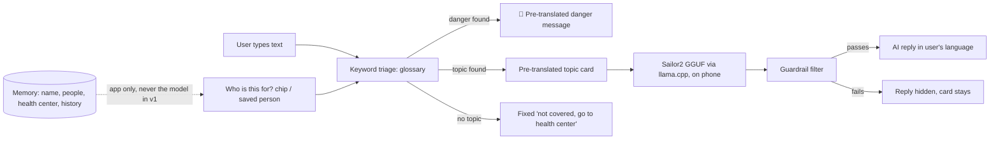

# Architecture: Offline Multilingual Health Helper (Android)

> v2, Oct 9, ~23:00. **Combined plan** confirmed by the project owner: the offline health helper scope
> (`docs/PRD.md`) built on the language collaborator's model track (Sailor2-1B GGUF + llama.cpp + LoRA).
> This file is the source of truth for the **tech stack**. Verified facts: `docs/PROJECT_FACTS.md`.
> Fork reasoning: `docs/DECISIONS.md`. App ↔ model contract: `docs/handoff.md`.
> **v2.1 (Oct 9, late):** adds the **Health Library** (`content/HealthLibrary.kt`), **patient context** in triage, and
> optional on-phone **memory** (`lib/memory/`, Room + DataStore). PRD use cases 8–9. Teammate's part: `docs/teammate-tasks.md`.

## What it does

A native Android app for people with **no signal**. The user types a health worry in **Bisaya, Waray,
Tagalog/Taglish, or English**. A keyword glossary instantly checks for **danger signs** and picks one of
**7 first-aid topics**. The app shows a **pre-translated topic card**. Then an **on-device Sailor2-1B model
(LoRA-adapted on Waray health chat pairs)** writes a short, natural reply in the user's language, grounded in
that card. Deterministic guardrails filter anything unsafe before it reaches the screen. The internet is used
once, to download the model. After that, everything works in airplane mode.

## User flow



Speech input (later milestone): record → separate offline speech-to-text → **editable transcript** → same chat input.

## Tech stack

| Layer | Choice | Why (if it was a fork) |
|---|---|---|
| Language / UI | Kotlin 2.2.10, Jetpack Compose (BOM 2026.02.01) + Material 3 | Same toolchain as the working Vault project. No LiteRT-LM, so no Kotlin 2.4 bump needed |
| Build | AGP 9.3.1, Gradle 9.5.0, JDK 17 | Verified on this laptop |
| Native inference | **llama.cpp** (pinned release tag, chosen in the Phase 0 spike), built from source with **NDK 27.1.12297006** + CMake, JNI wrapper module | Language collaborator's track. The official `examples/llama.android` sample declares minSdk 33, so it's adapted, not copied (`docs/handoff.md`) |
| Device target | **Android 9 / API 28+**, **`arm64-v8a`** only, first test phone has **6 GB RAM** | Language collaborator's compatibility target |
| Base model | **Sailor2-1B-Chat Q4_K_M GGUF** (`bartowski/Sailor2-1B-Chat-GGUF`, 738,628,576 bytes, Apache-2.0) | Published Waray coverage, small enough for 6 GB phones |
| Adapted model | `waray-health-vN.gguf`: LoRA merged into Sailor2-1B, quantized Q4_K_M | **Shipped only if it beats the baseline** on the held-out set |
| Fallback model (same runtime) | Gemma 4 E2B GGUF | Passed the classification test on Oct 9. Swap only if Sailor2 fails on the phone |
| Model download | Android **DownloadManager**, pinned URL, **SHA-256 verified** | Team decision: app downloads the model once, like `ollama pull` |
| Content ("Health Library") | Versioned JSON in `assets/content/`, read only by `content/HealthLibrary.kt`, validated by unit tests | Team edits JSON directly. Holds the verified facts *and* the guardrail terms |
| Settings | Jetpack DataStore | Language + model choice |
| Memory (optional, opt-in) | **Room (SQLite)** for people + history, **DataStore** for name / health center / on-off. Both behind `lib/memory/MemoryRepository.kt` | Lists that grow need a database. Single values don't. Room + KSP on AGP 9.3.1 is **unverified**: 15-min build spike first, fallback is the framework `SQLiteOpenHelper` behind the same repository |
| Training | PyTorch (cu128) + Transformers + **PEFT/TRL** LoRA on the **RTX 4050 6 GB** laptop. Then merge → llama.cpp `convert_hf_to_gguf.py` → `llama-quantize Q4_K_M` | See `training/README.md`. The 1050 Ti 4 GB is too tight |
| Eval (laptop) | Python + Ollama loading the same GGUF files | Same weights as the phone |
| Database / backend / auth | **On-phone Room database only (memory)**. No backend, no server, no accounts or login | Memory is local and opt-in. A login on an offline single-user phone protects nothing |
| Distribution | GitHub Release: APK + adapted GGUF asset (< 2 GB, fits GitHub's limit) | Repo never holds model files |

Versions are **pinned exactly**. No `latest.release`, no floating llama.cpp `master`.

## Configuration (no secrets)

No API keys or secrets, so there's no env-var contract. Model constants live in `lib/llm/ModelSpec.kt`:

| Model | URL (pinned) | SHA-256 |
|---|---|---|
| Baseline Sailor2-1B Q4_K_M | `https://huggingface.co/bartowski/Sailor2-1B-Chat-GGUF/resolve/9f8154a0ffdf04bb7f29e4f6c3cb938b9178dba3/Sailor2-1B-Chat-Q4_K_M.gguf` | `782e8abed13d51a2083eadfb2f6d94c2cd77940532f612a99e6f6bec9b3501d4` |
| Adapted `waray-health-vN.gguf` | GitHub Release asset URL (set when delivered) | recorded in the `docs/handoff.md` delivery note |

## Data model

Two separate stores, kept apart on purpose: the **Health Library** (public, verified, shipped in the APK, read-only)
and **Memory** (private, on this phone only, opt-in). Personal data never goes into the library, and the library is
never copied into memory. With memory off, **runtime state is in memory only and cleared when the app closes**.

- Enums (defined once in `domain/model/`):
  - `Language`: `CEB` Bisaya, `WAR` Waray, `TGL` Tagalog/Taglish, `ENG`
  - `TopicId`: `CHILD_DIARRHEA`, `FEVER`, `COUGH_BREATHING`, `WOUND_BLEEDING`, `BURN`, `PREGNANCY_WARNING`, `DENGUE_WARNING`, `NONE`
  - `DangerSignId`: `CANNOT_DRINK`, `VOMITS_EVERYTHING`, `BLOOD_IN_STOOL`, `VERY_SLEEPY`, `DIFFICULTY_BREATHING`, `SEVERE_BLEEDING`, `PREGNANCY_BLEEDING`, `SEIZURE`, `CHEST_PAIN`, `UNCONSCIOUS`
  - `PatientGroup`: `UNKNOWN`, `YOUNG_INFANT`, `CHILD`, `ADULT`, `PREGNANT`. Proposed bands follow WHO IMCI (young infant
    < 2 months, child 2 months–5 years). **The content owner confirms the bands from the cited source.**

### Health Library (`assets/content/`, team-written, all 4 languages)

```
TopicId 1---4 TopicCard          (one per Language)
DangerSignId 1---4 DangerMessage (one per Language)
GlossaryEntry *---1 TopicId | DangerSignId | PatientGroup
PatientRule *---1 PatientGroup, adds DangerSignId | TopicId
GuardrailTerm *---1 kind (DRUG | DOSE_UNIT | DIAGNOSIS | DOWNPLAY), per Language
UiString key 1---4 text          (one per Language)
```

| File | Key | Required / constraints |
|---|---|---|
| `topics/<topic_id>.json` | (`topicId`, `language`) | `title`, `atHome[]` ≥1, `goNowIf[]` ≥1, `source` citation. All 4 languages |
| `danger_signs.json` | (`dangerSignId`, `language`) | `text` non-empty, every sign × 4 languages |
| `glossary.json` | normalized `term`, unique | `target` is a valid TopicId/DangerSignId/PatientGroup, `stem` bool |
| `patient_rules.json` | (`group`, `when`) | `when` is a TopicId or DangerSignId. `adds` is a DangerSignId or TopicId. **`source` required**. Rules only add |
| `guardrail_terms.json` | (`kind`, normalized `term`), unique | `kind` ∈ DRUG, DOSE_UNIT, DIAGNOSIS, DOWNPLAY. DOWNPLAY covers all 4 languages |
| `ui_strings.json` | (`key`, `language`) | every key used in code × 4 languages, incl. greeting, chips, consent sheet, "Forget everything" |

`ContentValidationTest` fails the build on broken JSON, a missing language, an empty field, duplicate terms, an
invalid target, a topic or danger sign with no glossary term, or a patient rule with no source.

### Memory (`lib/memory/`, on-phone, opt-in)

| Store | Entity / key | Fields + constraints |
|---|---|---|
| DataStore `memory.preferences_pb` | profile | `memoryEnabled` (bool, default **false**), `consentAt?`, `displayName?` (≤ 40), `healthCenterName?` (≤ 80), `healthCenterPhone?` (digits, `+`, spaces; ≤ 20) |
| Room `person` | `id` PK auto | `nickname` NOT NULL, 1–40 chars. `birthYearMonth?` (`YYYY-MM`). `pregnantSince?` (date). `createdAt` NOT NULL |
| Room `history_entry` | `id` PK auto | `personId?` FK → `person.id` **ON DELETE CASCADE**. `createdAt` NOT NULL. `language` NOT NULL. `userText` NOT NULL (≤ 2000). `topicId` NOT NULL. `dangerSignIds` (TypeConverter list). `aiReply?` (guardrail-passed text only) |
| Indexes | | `history_entry(personId, createdAt DESC)` for per-person recent lists. `history_entry(createdAt)` for the retention purge |

```
person 1---* history_entry   (deleting a person deletes their history)
profile (single values, DataStore)
```

- **Group is computed, never stored:** `domain/PersonGroup.of(person, today)`. Pregnancy expires 10 months after
  `pregnantSince` **[ASSUMPTION]**. A saved baby becomes a child automatically, so danger rules stay age-correct.
- **History stores ids, not rendered cards.** A reopened entry re-renders the card from the Health Library in the
  current language.
- **Retention:** entries older than 30 days are purged on app start **[ASSUMPTION]**.
- **Migrations:** schema v1, `exportSchema = true`. Later versions need explicit migrations. Never use
  `fallbackToDestructiveMigration` (it would silently wipe the user's memory).
- Language stays in `SettingsStore` (app setting), so "Forget everything" doesn't reset it.

## Core flows

### Send pipeline
1. **Keyword triage** (sync, < 1 ms, `domain/Triage.kt`): `triage(text, patientGroup)`. Normalize the text and match
   glossary terms. Returns `dangers`, ranked `topics`, and `inferredGroup` (from glossary words or a saved nickname).
   Then apply `patient_rules` for the selected group. **The glossary is the router.** Sailor2-1B failed JSON
   classification in testing (PROJECT_FACTS.md), so the model doesn't classify. **Invariant:** for every group,
   `dangers(text, g) ⊇ dangers(text, UNKNOWN)`. Patient context only adds.
2. **Instant UI:** 🔴 danger message(s) in the user's language, plus the top topic card (or the fixed
   "not covered" text if no topic matched). This is complete and safe on its own. The 🔴 banner fills in the saved
   health center (name + number) if there is one, and always shows 911. The "Who is this for?" chips appear under
   the result. Changing a chip re-runs step 1.
3. **AI reply** (async, only if a topic matched): `LlmEngine.generate(systemPrompt, card(ENG) + card(userLang), userText)`
   streams a short reply (max ~160 tokens, context ≤ 2048, GGUF's built-in chat template). **v1: the prompt never
   includes patient context or memory** (keeps the LoRA training template unchanged, see `docs/handoff.md`).
4. **Guardrail filter** (`domain/Guardrail.kt`, pure function, test-first). Terms come from `guardrail_terms.json`
   through `HealthLibrary`. It rejects the reply if it contains: a dose/quantity pattern (digits + a DOSE_UNIT term
   such as `mg|ml|ml/kg|tablet|kutsara|beses`…), a DRUG term (`ibuprofen`, `paracetamol`, `antibiotic`,
   `amoxicillin`…), a DIAGNOSIS phrase, **a phone-number pattern** (numbers only come from content or the user),
   or, **when a 🔴 is shown, a DOWNPLAY phrase** ("no need to go", "okay ra"…). It also rejects empty or overlong
   output. Rejected → the reply is hidden, and the card and danger messages stay. **The model can never add or
   remove a danger warning.**
5. **Save (only if memory is on):** `ChatService` writes one `history_entry` (ids + user text + guardrail-passed
   reply) through `MemoryRepository`. Memory off → nothing is written.
6. Every screen shows the "not a doctor, no diagnosis" line.

### Memory lifecycle
```
first launch → memoryEnabled = false → app works exactly as with no memory
after a useful answer → app offers "Save <person>?" (fixed text) → consent sheet → [Save] memoryEnabled = true | [Not now] nothing stored
app start (memory on) → purge history > 30 days → load profile + people
DB open fails / disk full → memory off for this session + quiet notice. Triage, cards, and AI still work
"Forget everything" → delete all Room rows + clear profile keys → memoryEnabled = false
```
The model never asks for personal details. All memory prompts are fixed, pre-translated app text.

### Model lifecycle
```
start → model file present + SHA-256 verified? ── no → ModelSetupScreen → DownloadManager → verify → marker file
   yes → LlmEngine.load() on a background thread → WARMING → READY | FAILED
   FAILED / missing → keyword-only mode: triage + cards still fully work, with a notice. Never crash.
```

### Training → delivery (language collaborator + training laptop)
`evaluation/` held-out set (written first) → baseline run → `training/` reviewed pairs → LoRA (PEFT/TRL, RTX 4050)
→ compare on the same held-out set → if better: merge → GGUF → Q4_K_M → SHA-256 → handoff note → GitHub Release
→ update `ModelSpec`.

## Components and owners

| Component | Owner | Input | Output |
|---|---|---|---|
| Android chat UI + flows | Android collaborator | User text | Cards, danger messages, AI reply |
| Local runtime (`:llama` JNI module) | Android collaborator | Text + local GGUF path | Streamed text |
| Memory (`lib/memory`, People screen, consent sheet) | Android collaborator | User-saved profile, people, history | Greeting, chips, banner text, recent list |
| Content JSON (cards, danger messages, glossary, patient rules, guardrail terms, UI strings) | Language collaborator | DOH/WHO sources | `assets/content/*.json` (tasks: `docs/teammate-tasks.md`) |
| Eval set + chat pairs + LoRA run | Language collaborator (training laptop) | Reviewed Waray examples | Versioned GGUF + report |
| Offline speech-to-text | Joint | Audio | Editable transcript (later) |

## Permissions and security baseline

No auth, no payments, no backend, so the hard-halts don't apply. **If an app lock is added later (v2), use Android's
device credential via `BiometricPrompt`. Never a hand-rolled PIN or password. If encryption at rest is needed, use
SQLCipher. Never custom crypto.** Checklist:
- [ ] `INTERNET` is used only by the DownloadManager request in `lib/llm/ModelDownloader.kt`, the only network code.
- [ ] Model SHA-256 verified before first load (`java.security.MessageDigest`). A mismatch deletes the file.
- [ ] HTTPS only (`usesCleartextTraffic=false`). `allowBackup=false`. Only `MainActivity` is exported.
- [ ] User text is never logged or sent anywhere. It's written to disk **only** into the app-private Room database,
      and only when the user turned memory on.
- [ ] Memory is off by default. It's turned on only through the consent sheet (what's saved, stays on this phone,
      others using this phone can see it, delete anytime). Health data is sensitive personal information (RA 10173).
- [ ] "Forget everything", per-person delete (cascades), and per-entry delete all work. 30-day history purge on start.
- [ ] Room queries are DAO-parameterized only. No SQL string concatenation (fallback `SQLiteOpenHelper` uses `?` args).
- [ ] llama.cpp source pinned to a release tag, with the tag + commit recorded in PROJECT_FACTS.md. Gradle deps pinned.
- [ ] Medical guardrails are enforced in code: danger detection is deterministic, local-language safety text comes
      from content files, and the model's reply always passes `Guardrail` before display.
- [ ] Training data: no private or identifying information. Rights recorded per row (`training/README.md`).

## Folder structure

```
android/
  settings.gradle.kts, build.gradle.kts, gradle/, gradlew(.bat)
  llama/                         ← JNI library module: llama.cpp (pinned) + CMakeLists + LlamaBridge.kt
  app/
    src/main/assets/content/     ← topics/*.json, danger_signs.json, glossary.json, patient_rules.json,
                                    guardrail_terms.json, ui_strings.json
    src/main/java/ph/appbuilders/offlinehealth/
      MainActivity.kt
      app/                       ← AppContainer (manual wiring), AppNavigation, theme/
      features/
        onboarding/              ← LanguagePickerScreen
        modelsetup/              ← ModelSetupScreen + ViewModel (download/verify/status)
        chat/                    ← ChatScreen, ChatViewModel, ChatService (triage + library + memory + llm),
                                    components/ (PersonChips, RecentList, MemoryConsentSheet, …)
        topics/                  ← TopicListScreen (browse without typing)
        people/                  ← PeopleScreen, PersonEditSheet, PeopleViewModel, PeopleService
        settings/                ← SettingsScreen (+ My health center, Memory on/off, Forget everything)
      domain/                    ← PURE Kotlin, unit-tested: model/ (incl. PatientGroup, Person, HistoryItem),
                                    Triage.kt, Guardrail.kt, PromptBuilder.kt, PersonGroup.kt
      content/HealthLibrary.kt   ← the ONLY reader of assets/content/
      lib/
        llm/LlmEngine.kt         ← the ONLY file that calls the :llama module
        llm/ModelSpec.kt, llm/ModelDownloader.kt (only network code)
        settings/SettingsStore.kt
        memory/MemoryRepository.kt ← the ONLY door to personal data (maps Room entities ↔ domain models)
        memory/ProfileStore.kt   ← DataStore: memoryEnabled, name, health center
        memory/db/               ← MemoryDatabase, PersonEntity, HistoryEntity, PersonDao, HistoryDao
    src/test/…                   ← TriageTest, GuardrailTest, PromptBuilderTest, ContentValidationTest, PersonGroupTest
    src/test or src/androidTest/… ← MemoryRepositoryTest (Room in-memory DB)
evaluation/                      ← held-out test set (CSV) + run_eval.py (Ollama, same GGUF)
training/                        ← reviewed pairs (CSV), prepare/train/export scripts, run notes
docs/
spikes/android-llm/              ← Oct 9 LiteRT-LM spike (superseded runtime, kept as record)
```

### Layer rules (binding)
| Layer | Files | May | Must not |
|---|---|---|---|
| UI | `*Screen.kt`, `components/` | Render state, forward events | Call services/lib, hold rules |
| Thin layer | `*ViewModel.kt`, `AppNavigation.kt` | Hold UI state, call one service | Contain triage/guardrail logic |
| Business logic | `*Service.kt`, `domain/` | Triage, guardrails, prompt building | `domain/` imports no Android |
| Infrastructure | `lib/`, `content/`, `:llama` | Native inference, download, storage, assets | Contain medical rules |

**Where new code goes:** a screen → `features/<name>/`. A medical/safety rule → `domain/`, test first.
Native, network, or storage code → `lib/`. Text the user reads in their language → `assets/content/` (4 languages).
**Memory boundaries:** Room entities and DAOs never leave `lib/memory/`. Feature code sees only domain models from
`MemoryRepository`. Screens never touch the repository (Screen → ViewModel → Service → Repository). Medical rules
that use a person's group live in `domain/` + `patient_rules.json`, never in `lib/memory/` or UI.

## Testing policy
- **Test-first:** `Triage` (every glossary danger term triggers its sign; patient rules fire; the superset invariant
  holds for every group), `Guardrail` (dose/drug patterns blocked, including the real Oct 9 Sailor2 outputs as
  fixtures; phone numbers blocked; DOWNPLAY blocked only when a 🔴 is shown), `PersonGroup` (band edges, pregnancy
  expiry, missing birth month → UNKNOWN), `PromptBuilder`, `ContentValidationTest`, SHA-256 check.
- **Memory (privacy-critical, test-first):** `MemoryRepositoryTest` on an in-memory Room DB. "Forget everything"
  leaves 0 rows and empty profile keys. Deleting a person cascades to their history. The purge drops > 30-day entries
  and keeps newer ones. Memory off writes nothing.
- Logic tests use **placeholder content fixtures** until the content owner delivers the real JSON.
- **Model quality:** `evaluation/run_eval.py` on the held-out set, baseline vs adapted, speaker-rated (`docs/testing.md`).
- **Device:** `docs/testing.md` Android acceptance check on the 6 GB phone in airplane mode.
- No tests for layout or copy.

## Open decisions
1. **llama.cpp tag + Android binding approach** (adapt `llama.android` to API 28 vs a minimal custom JNI): Phase 0 spike.
2. **Context size / max tokens** on the 6 GB phone: from device measurements.
3. **Ship baseline vs adapted model:** decided by the held-out eval, not by training loss.
4. **App/package name:** `ph.appbuilders.offlinehealth` is a placeholder **[ASSUMPTION]**.
5. **Card sources:** which DOH/WHO documents each card cites.
6. **Room + KSP on AGP 9.3.1 / Kotlin 2.2.10:** unverified. 15-min build spike before memory work. Fallback: `SQLiteOpenHelper`.
7. **Age bands, patient rules, retention (30 days), pregnancy expiry (10 months):** content owner confirms (`docs/teammate-tasks.md`).
